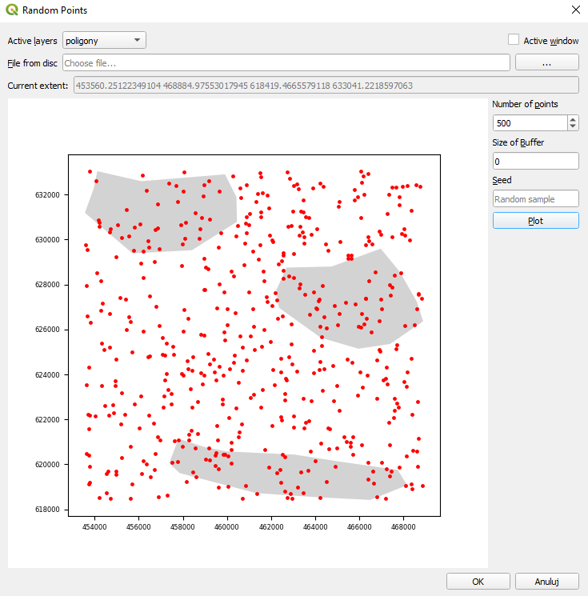

# RandomSamplingPlugin

QGIS plugin that gives more control over points sampling process.
It was created during GIS programming course.

- choose sampling extent from file, QGIS project layer or canvas extent
- set buffer value to modify sampling extent
- review samples' distribution before creating a layer
- use random seed to replicate your samplings

# Installation

1. Click Code -> Download ZIP

2. Install plugin in QGIS plugin manager using downloaded .zip file.
